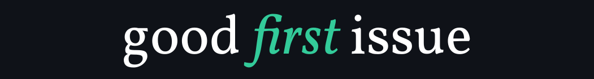

<p align="center">
  <a href="https://goodfirstissue.dev" target="_blank">
    
  </a>
</p>
<hr>

## Project Overview
Good First Issue helps beginners contribute to open-source by curating projects with easy-to-fix issues labeled `good first issue`. 
The project has two main components:
- **Frontend:** Built with Vue.js using the Nuxt.js framework
- **Backend/Data script:** Written in Python

Welcome! 👋🏼

**Good First Issue** is an initiative to curate easy pickings from popular projects, so developers who've never contributed to open-source can get started quickly.

Open-source maintainers are always looking to get more people involved, but new developers generally think it's challenging to become a contributor. We believe getting developers to fix super-easy issues removes the barrier for future contributions. This is why Good First Issue exists.

## Table of Contents
1. [Project Overview](#project-overview)
2. [Adding a New Project](#adding-a-new-project)
3. [Setting Up the Project Locally](#setting-up-the-project-locally)

## Adding a new project

You're welcome to add a new project in Good First Issue, and we encourage all projects &mdash; old and new, big and small.

Follow these simple steps:

- Our goal is to narrow down projects for new open-source contributors. To maintain the quality of projects in Good First Issue, please make sure your GitHub repository meets the following criteria:

  - It has at least three issues with the `good first issue` label. This label is already present on all repositories by default. If not, you can follow the steps [here](https://help.github.com/en/github/managing-your-work-on-github/applying-labels-to-issues-and-pull-requests).

  - It has at least 10 contributors.

  - It contains a README.md with detailed setup instructions for the project, and a CONTRIBUTING.md with guidelines for new contributors.

  - It is actively maintained.

- Add your repository's path (in lexicographic order) in [data/repositories.toml](data/repositories.toml).

- Create a new pull-request. Please add the link to the issues page of the repository in the PR description. Once the pull request is merged, the changes will be live on [goodfirstissue.dev](https://goodfirstissue.dev/).

## Setting up the project locally

Good First Issue has two components — the front-end app built with Nuxt.js and a data population script written in Python.

### Prerequisites
- Python 3
- Node.js (latest version)

To contribute new features and changes to the website, you would want to run the app locally. Please follow these steps:

1. Clone the project locally. Make sure you have Python 3 and a recent version of Node.js installed on your computer.
```bash
git clone https://github.com/AyushMaurya3114/good-first-issue.git
cd good-first-issue
```
2. Make a copy of the sample data files for your local app to use and rename them to the filename that the app expects. **This step is important, as the front-end app won't work without these data files.**

```bash
$ cp data/generated.sample.json data/generated.json
$ cp data/tags.sample.json data/tags.json
```

3. Build the front-end app and start the development server.

```bash
$ bun install # install the dependencies
$ bun dev # start the development server
```

The app should open in your browser.
